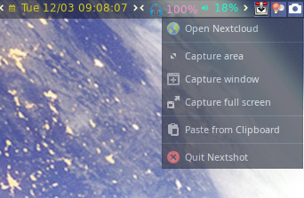

# Nextshot

[](https://github.com/dshoreman/nextshot/releases)
[](https://aur.archlinux.org/packages/nextshot)
[](https://travis-ci.com/dshoreman/nextshot)

Nextshot is a simple utility for taking and sharing screenshots on Linux.

By default it will automatically upload your screenshot to Nextcloud, share with the
default settings and copy the resulting link to the primary clipboard. It can also
copy to/from clipboard and share local files.

#### Compatibility

From the start, the primary goal has been to work with both i3 and Sway. Since the release
of  1.0, this has largely been achieved. While Nextshot will work on Sway and likely most
X11-based environments, the nature of Wayland means extra work will be required for eventual
compatibility with compositors other than Sway.

*TL;DR: YMMV*

## Table of Contents

* [Introduction](#nextshot)
* [Table of Contents](#table-of-contents)
* [Installation](#installation)
  * [Arch Linux](#arch-linux)
  * [Manual Install](#manual-install)
* [Usage](#usage)
  * [Screenshot Modes](#screenshot-modes)
  * [Upload Modes](#upload-modes)
  * [Tray Menu](#tray-menu)
  * [Recommended Shortcuts](#recommended-shortcuts)
* [Configuration](#configuration)
  * [Example nextshot.conf](#example-nextshotconf)
  * [Available Options](#available-options)
* [Troubleshooting](#troubleshooting)
* [Known Issues](#known-issues)

## Installation

### Arch Linux

Install `nextshot` and `yad` using your favourite AUR helper. Yad enables the tray menu
and is optional on i3, but required on Wayland to enable window selection if you activate
Nextshot with a keyboard shortcut.

```sh
pacaur -S nextshot && pacaur -S --asdeps yad
```

To check dependencies after installing Nextshot, run `nextshot --deps` in a terminal.
Some are required but listed in the `PKGBUILD` as optional - the packages you need
will vary based on which environment you run:

```sh
# To run Nextshot in i3 and other X11-based environments
sudo pacman -S --asdeps imagemagick slop xclip

# To run Nextshot in Sway
sudo pacman -S --asdeps grim slurp wl-clipboard
```

Nextshot will not automatically install any keyboard shortcuts. A set of [recommended
keybindings](#recommended-shortcuts) is provided below for users of i3 and Sway, which
can be tweaked to fit your personal workflow.

### Manual Install

For other distributions, install dependencies as above then run the following to install Nextshot:

```sh
git clone -b master https://github.com/dshoreman/nextshot.git
cd nextshot
sudo make install
```

## Usage

Nextshot can be used in a few ways, but it's most flexible when run in a terminal.
Some of the more common usage examples are listed below. For details on all available
CLI options, run `nextshot --help`.

### Screenshot Modes

The following examples will upload a screenshot to Nextcloud and copy the share link. To
bypass Nextcloud and instead copy the image to clipboard, add the `-c` or `--clipboard` option.

* **Capture an area/selection**

    `nextshot -a` or `nextshot --area`

* **Capture a specific window**

    `nextshot -w` or `nextshot --window`

* **Capture the entire desktop**

    `nextshot -f` or `nextshot --fullscreen`

Image capture can also be delayed by passing the `-d`, `--delay` option followed by a `TIMEOUT`, for
example `nextshot -d3.5` or `nextshot --delay 2m` to delay 3.5 seconds or 2 minutes respectively.

To abort selection in the `--area` or `--window` modes, press the Escape key.

### Upload Modes

There are two modes that support uploading an existing image to Nextcloud.

* **Share an image from the clipboard**

    `nextshot -p` or `nextshot --paste`

* **Share an image from the local filesystem**

    `nextshot --file kittens.jpg`

    **Note:** The `--file` option bypasses the rename prompt and [may overwrite
    existing files](#known-issues) if it is already in Nextcloud. To avoid issues,
    first rename or copy the image to ensure a unique filename in Nextcloud.

### Tray Menu

If you have Yad installed, you can use Nextshot via its tray icon. A normal click will
trigger Nextshot's [`--area`](#screenshot-modes) screenshot mode, while right clicking
will open a menu with quick access to most of Nextshot's functions.



The Nextshot tray menu can be started with `nextshot -t`, which you can add to `.xinitrc`
or your i3/Sway config to have it automatically started when you login.

### Recommended Shortcuts

To have Nextshot's primary functions bound to the Print Screen key on i3 and Sway, add the following
to your `config` file in `~/.config/i3` and/or `~/.config/sway` respectively:

```
bindsym Print exec --no-startup-id "nextshot -f"
bindsym Mod4+Print exec --no-startup-id "nextshot -w"
bindsym Shift+Print exec --no-startup-id "nextshot -a"

bindsym Ctrl+Print exec --no-startup-id "nextshot -fc"
bindsym Ctrl+Mod4+Print exec --no-startup-id "nextshot -wc"
bindsym Ctrl+Shift+Print exec --no-startup-id "nextshot -ac"
```

These bindings will have `PrtScr` capture the full screen, `Shift+PrtScr` capture an area, and
`Super+PrtScr` capture a window - each uploading automatically to Nextcloud and copying the
share link to your clipboard.

When combined with `ctrl`, the raw image will be copied to clipboard instead of uploading to Nextcloud.

## Configuration

The first time you run Nextshot, one of two things will happen. If you don't have Yad, you'll be
prompted to open an example config ready for editing in your `$EDITOR`. See below for details on
all available options.

If you *do* have Yad, a GUI will open for you to enter your settings. Follow the instructions and
click Ok. You'll now see a preview of the config - correct any mistakes and click Save when you're done.

### Example `nextshot.conf`

The `nextshot.conf` file should be stored in the `~/.config/nextshot` directory, which is created
automatically when you first run Nextshot. It's sourced as a Bash script, so config options are
assigned much the same way as you would define any regular Bash variables:

```bash
server='https://example.com/nextcloud'
username='jenBloggs'
password='rcPn0-zyKC9-Dt0Vn-LG9Cn-Aa3EE'
savedir='Screenshots'
rename=false
```

### Available Options

#### `server` - required

This is the base URL to your Nextcloud instance, including `http[s]://` but excluding the trailing `/`.
It may be for example `https://nc.example.com` or `https://example.com/nextcloud` depending on whether
you use a subdomain specific to Nextcloud or simply host it in a folder on your main website.

---

#### `username` - required

The username you use for Nextcloud, used to authenticate with the API when uploading screenshots.

---

#### `password` - required

This is **not** your Nextcloud account password but an *App Password* that you create specifically
for Nextshot, to be used in conjunction with your `username` for API authentication.

You can create an App password by going to **Settings > Personal > Security** in your Nextcloud UI.

Assuming your Nextcloud is hosted at *nc.example.com*:
1. Head to https://nc.example.com/settings/user/security
2. Enter `Nextshot` in the *App name* input
3. Click *Create new app password* and enter your account password to confirm
5. Copy the resulting App Password to your config, then click Done

The app password will be 5 blocks of alphanumeric characters, separated by dashes.

---

#### `savedir` - required

The name of a folder on your Nextcloud instance which should be used to upload screenshots.

This is relative to your Nextcloud root. To have your screenshots uploaded to a `Screenshots`
folder inside the root-level `Photos` directory, you would set `savedir='Photos/Screenshots'`
in your config file.

Note that this folder is not created automatically, so it must exist in Nextcloud *before* running Nextshot.

---

#### `link_previews` - optional

When set to `true`, Nextshot will append `/preview` to generated share links. With this option enabled,
clicking the link will take you directly to the full-size image rather than Nextcloud's default share UI.

Defaults to `false`

---

#### `rename` - optional

When you set this option to `true`, Nextshot will prompt you to enter a custom filename before
uploading to Nextcloud. Be sure to include the extension as it will not be added automatically.
Triggering Nextshot from the [#tray-menu](tray menu) or a [#recommended-shortcuts](keybinding) will require Yad for the rename prompt.

Defaults to `false`.

---

#### `hlColour` - optional

Set this to customise the highlight colour when selecting an area or window to screenshot.

It should be specified as comma-separated RGB so that Nextshot can parse the individual colour
values and pass them along to either Slop or Slurp, depending on whether you use X11 or Wayland.

Defaults to `255,100,180`.

## Troubleshooting

#### Nextshot is detecting the wrong environment

In some cases it may be that Nextshot's environment detection doesn't quite work as expected. One
example of this might be if your system has both X11 *and* Wayland. If you were to start a tmux
session under X11 then switch to Wayland and run Nextshot from within tmux, it will think you're
running under the X11 environment when that's not really the case.

To fix this you can bypass the default detection method:
```sh
nextshot --env=wayland ...
```

For a more permanent fix, you can set or `export` the `NEXTSHOT_ENV` environment variable:
```sh
export NEXTSHOT_ENV=wayland
nextshot ...

# or

NEXTSHOT_ENV=wayland nextshot ...
```

Likewise if you're running from X11 but Nextshot detects Wayland, you can set `--env` or
`NEXTSHOT_ENV` to `x11`. For more details and possible values, see `nextshot --help`.

## Known Issues

* [Tray menu is currently unavailable on Wayland](https://github.com/dshoreman/nextshot/issues/48)
